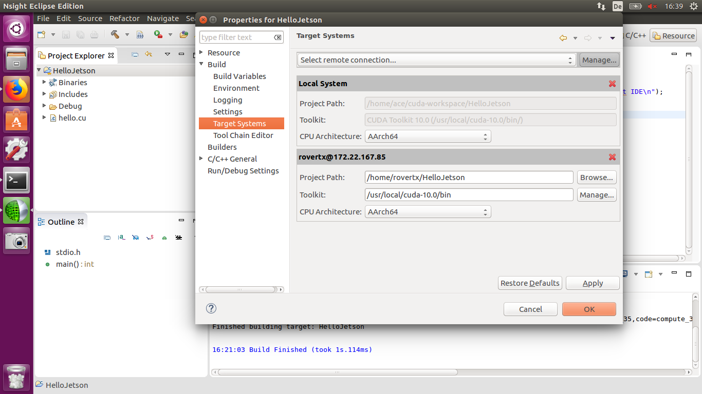
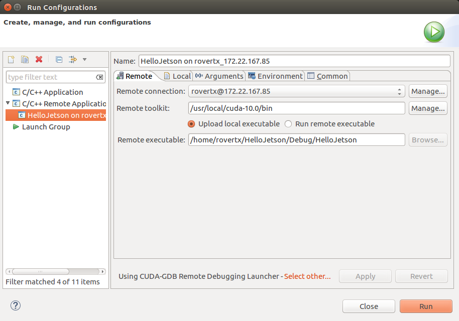
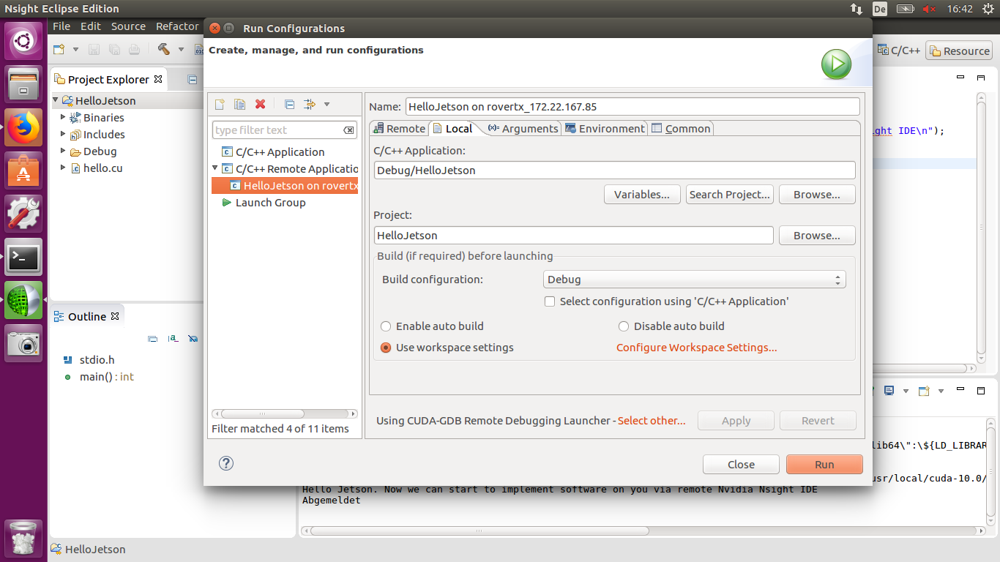
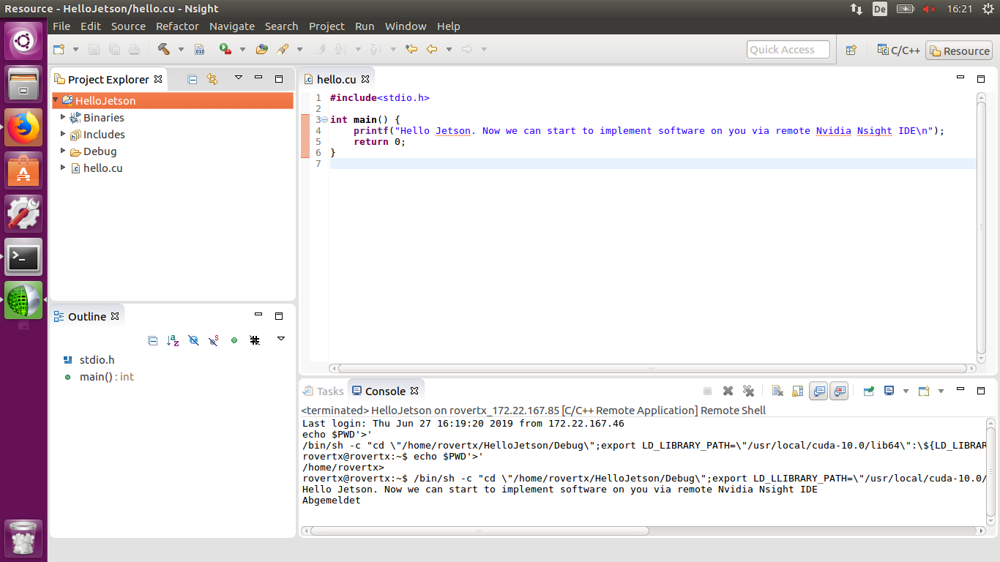
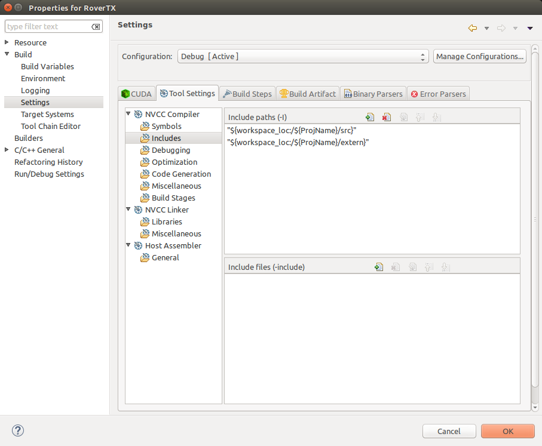
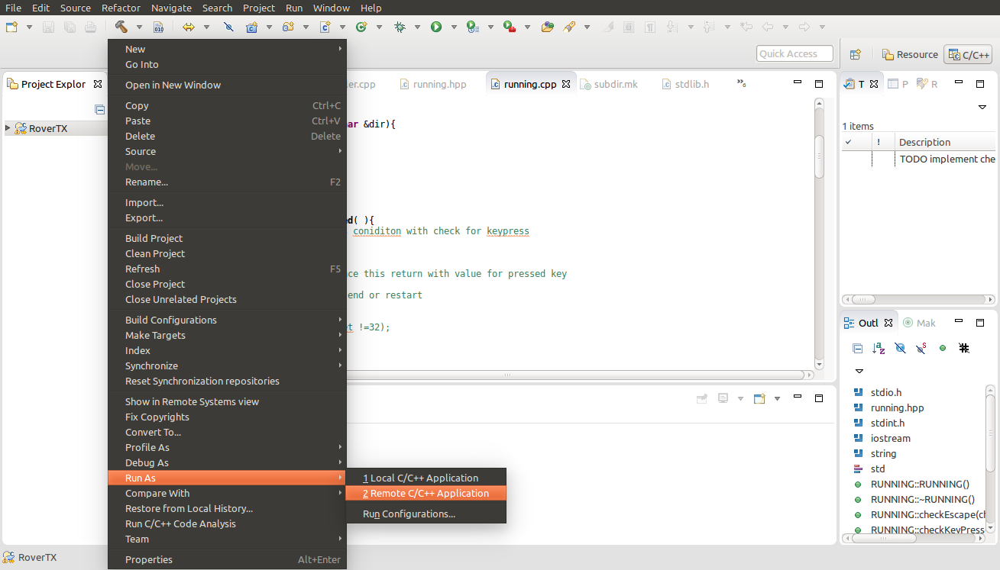
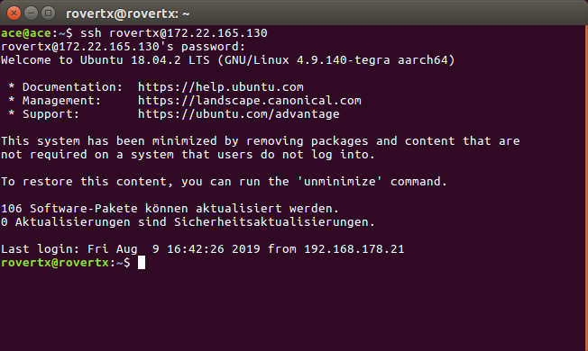
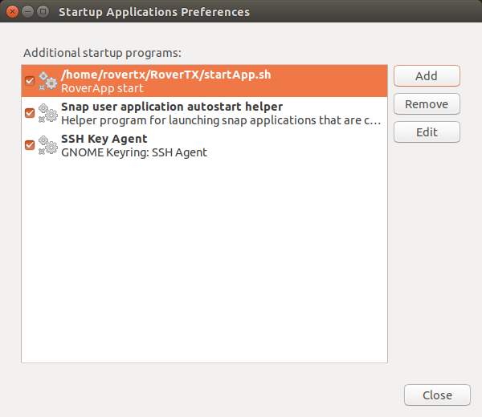

.. toctree::
   :glob:

Installation and Preparation
############################

*************************************************
Flashing the Jetson TX2
*************************************************
To get the new Jetpack 4.2 Version, CUDA Cross-Compiler, the Nsight Eclipse IDE and other useful software components on Jetson TX2 and Host-PC it is required to flash it from an other PC (Host-PC) in force recovery mode.
It is recommended to use the Nvidia SDK Manager, otherwise you have to search and select all required software components and then you have to install them all manually.
For the flashing procedure with SDK Manager just follow the documentation in this link: https://www.jetsonhacks.com/2019/06/04/nvidia-sdk-manager-for-jetson-jetpack-4-2/ or https://docs.nvidia.com/sdk-manager/index.html .
For flashing of the Jetson TX2 with your host PC use the Ubuntu 16.04 Version, otherwise the connection from the mini-USB port will disconnect.
By using a VM on Windows you get similar problems. After a finished installation and flashing of Jetson TX2 the screen as in the picture below is shown.

.. figure:: pictures/software/IMG_20190619_140416.jpg
    :width: 400
    :height: 400
    :alt: Finished SDKManager installation
    :figclass: center

*************************************************
Preparation to start implementation of Jetson
*************************************************
Java Runtime Enviroment
=======================
To start Eclipse Nsight IDE the Java Runtime Enviroment is required.
You have to use Version 8, please check the current version in terminal via :

	.. code-block:: bash
	
		$ java -version

If the current version isn't the correct one, then please change it.
To do so use in the terminal the following command :

	.. code-block:: bash
	
		$ sudo update-alternatives --config java
		
Select the number of JRE 8 or install the version via command :

	.. code-block:: bash
	
		$ apt-get install openjdk-8-jre

I2C interface
==============
The I2C interface is required to get access to the pwm driver.
Therfore, the I2C drivers should be installed on the Jetson TX2 via the command :

	.. code-block:: bash
	
		$ sudo apt-get install libi2c-dev i2c-tools
		
To search for the connected I2C devices the follwing command :

	.. code-block:: bash
	
		sudo i2cdetect -y -r 1 
		
has to be run in the terminal.
The default I2C adress for connected pwm driver is 0x40 which you can check with the result of the command.

*************************************************
Configuration Nvidia Nsight Remote
*************************************************
Create project
==============
For implementations on the Jetson TX2 the IDE Nvidia Eclipse Nsight is used, which was already installed in the last step with
SDK Manager.
To implement and debug on the Jetson TX2 via remote some configurations of the Eclipse Nsight are necessary.
For a detailed documentation about creating a project to run remote please follow this link: https://medium.com/@rajeshkumar/executing-cuda-c-application-on-a-remote-machine-using-nsight-eclipse-fb8364029625 .

After creating a CUDA C/C++ project the configuration of the target system is required.
Manage the remote connection by entering the ip adress from the Jetson TX2 (in terminal use the command: ifconfig) as host and username (in terminal: hostname).
As shown in the picture below the target system configuration is inside the project setting menu -> Build -> Target Systems.
Because the Jetson TX2 and Host-PC are linux systems please select Aarch64 architecture, otherwise the build application won't be executable on any side.

The next step is the debug/run configuration for remote application.
The configuration can be done for the debug and run mode in the debug configuration or run configuration menu of the selected project.
As shown in the picture, firstly the remote connection has to be set via manage the connection to Jetson TX2.
If this connection is selected the toolkit and the executable field gets automatically completed. Please be aware to click on the "Upload local executable" option.
If the local path of the C/C++ application is correct, the debugging and the running of the application via the linux host pc can start now.
For example a Hello World application runs on the Jetson TX2 and the result is delivered to the console of the linux host pc.

	

	
*************************************************
Add Libaries
*************************************************
To include the drivers or written libaries it is necessary to include the source path to the compile configuration.
The picture below shows how to include the source folder inside the project properties.

	
*************************************************
Start Application
*************************************************

To start an application the compilation of the implementation via "Run as->Remote Application" is necessary.
If you want to run the application without any root rights it will automatically start after the transmission.
Then the results will be shown in the terminal.
As required in this application the root right are necessary to get access to the GPIOs.
This can be done via terminal and the ssh connection as shown in the picture below by :

	.. code-block:: bash

		$ sudo ./RoverTX/Debug

the application gets started with the root rights and the GPIOs can be used without any permission problems.
When the prefix "sudo" is used then it is necessary to enter the password. To avoid the entering of the password please follow :

	.. code-block:: bash
	
		$ sudo visudo
		
Then add at the bottom of the opening window:
	"USERNAME" ALL=(ALL)NOPASSWD: ALL
	
This line allows the user USERNAME to execute sudo command without entering a password, please replace "USERNAME" with your username and without "".
This is also required to autostart the application after restart.

*************************************************
Autostart
*************************************************
For the automatical start of the application after restart or turn on/off the Jetson TX2 a script for autostart is necessary.
This usage of the script has to be executable and embedded in the autostart configuration.

Create and edit script:

	.. code-block:: bash
	
		$ sudo nano RoverTX/startApp.Sh
			#!/bin/bash
			sudo ./RoverTX/Debug		
	
Make script executable:

	.. code-block:: bash
	
		$ sudo chmod +x RoverTX/startApp.sh

Emebedded script into autostart via opening the programm startup application preferences:

	
After this setup the current version of the application will start automatically.

Please be careful if you try to start a new version of the same application.
Via the following command you get the processnumber of the old application:

	.. code-block:: bash
	
		$ ps aux
		
You have to shutdown the old version first :

	.. code-block:: bash
	
		$ sudo kill "processnumber"

		
Now the application is not running anymore and you can upload it to the Jetson TX2 and start it.
If you restart the Jetson TX2 then this new version will start automatically.
