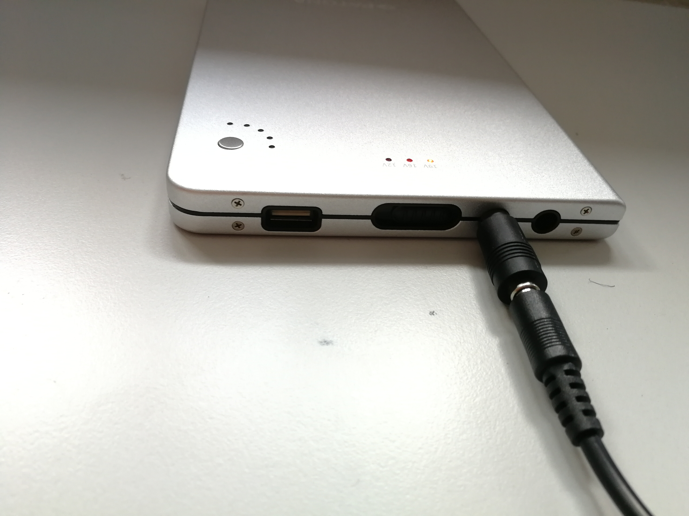
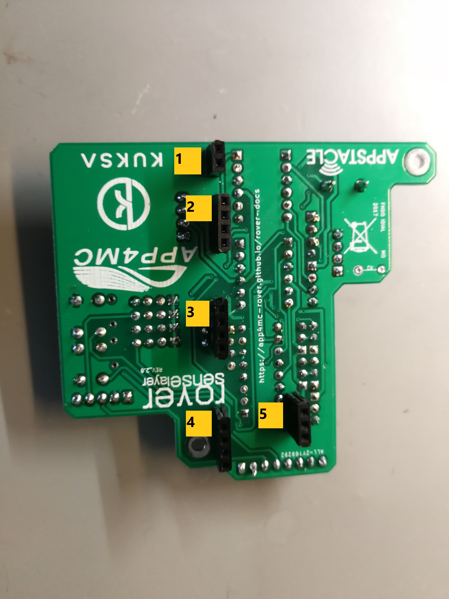

.. toctree::
   :glob:

RoverTX Hardware
#########################
Components to cover the functionality of the RoverTX and for fixing them onto it are in the table below:
 
.. csv-table:: **Hardware table for RoverTX**
   :header-rows: 1
   :widths: 1 6 2 1 
   :file: tables/Komponentenliste.csv
   
Some components are avaible in higher amount, for example the screws for fixing but these components can still become useful during the development process.

*******************
Movement Components
*******************
Rover Chassis with Motors
=========================
As movement component the Dagu 5 chasis with motor is used.
This chassis is a 4WD and has an additional encoder for each motor.
For the reqiured "follow hand" application just two motors are necessary for moving back and forward.
So, you are free to choose which motor to use.
In this construction both motors on the front side were selected.
An other option could be to connect both motors on either left or right hand side, because they use the same signals.
For the required application it is not necessary to have much movement power thus the two front motors are enough for the ourpose of the demonstrator.

These two motors are connected to a motor shield and for additonal using of the encoders the connection to the Nvidia Jetson TX2 Developer Kit is possible.

Motor Shield
============
.. figure:: pictures/hardware/IMG_20190611_123956.jpg
    :width: 250px
    :height: 250px
    :alt: Motor Shield
    :align: right
The motor shield is a required component to control the motors in a safe way.
It recieves the power from the same powerbank as the Nvidia Jetson TX2.
Therefore, it is necessary to isolate the power supply for the motors from the Jetson TX2.
Without a motor shield the power supply for the motors would not be isolated from the Jetson TX2.
The isolation is necessary, because the motors need more power then the Jetson TX2.
As usual the VIN and GND port are connected to an extern power supply.
This extern power supply is the additional pwm driver.
The motor shield is also connected to the selected motors via the motor output ports M2/1OUT2/1.
Other input signals are coming from the pwm driver and Jetson TX2.

	
The motor shield gets the control signals for movement commands from the Jetson TX2 and then it transmits these commands as safe signals to the motors.
As import input signal the motor shield needs a pwm signal and a direction control signal to create the correct motor output signals.
The other used connections are shown in the table at the end of this chapter.

PWM Driver
============
As a required signal for the motor shield a pwm signal is necessary.
To get this pwm signals as input for the motor shield, the pwm driver is useful because the Jetson TX2 does not support pwm signals.
This pwm driver, the PCA9685, is connnected with the I2C interface and the 5V and 3.3V power supply pins from the Jetson TX2.
By connecting this pwm driver module with an extern power connection the option to supply other connected modules via the power connection is supported.
In this application the extern power supply comes from the usb port of the powerbank.
For connected devices this pwm driver delivers the power supply for the motor shield and the second power supply is for the different signals, GND and VDD, of the motor shield. 

In this picture you can see which pins are used and if you need to supply more components it is possible to use the other 13 ports.
This pwm driver allows to power supply and to generate pwm signals for 15 connections.

*******************************************
Computing Components and Power Supply
*******************************************
Nvidia Jetson TX2 Development Kit
=================================
As computing and main component of the RoverTX the Nvidia Jeson TX2 Development Kit is used.
The Jetson TX2 is a system-on-module with a heterogenous system architecture.
For a more detailed description of the Jetson TX2, please read documenations for example on 
`<https://elinux.org/Jetson_TX2>`_ or the datasheet on
`<https://www.google.com/search?client=firefox-b-d&channel=crow&q=jetson+tx2+dev+kit+datenblatt>`_. 

.. figure:: pictures/hardware/JetsonTX2.jpg
    :width: 500
    :height: 500
    :alt: Jetson TX2 on top of the rover chassis 
    :align: right	
The Jetson TX2 delivers many options for connections and for the required application.
For example the included camera can be useful to extend the hand detection process.
At the beginning of the implementation the proven sharp and ultrasonic components are used.
Therefore, the Jetson TX2 provides two options for connecting GPIOs.
The 40-pin expansion header and the 30-pin GPIO Header. For this application the 40-pin expansion header has been used.
This header also delivers GND, 3.3V and 5V DC and for example I2C interface, which can be useful for further components and extending of components.
To connect the sensors, motor, shield and encoders the regular GPIOs are used.
At this point it is possible to select for the most interfaces different voltages modes.
The voltage modes can be configured by the jumper position near the expansion header where two options are avaible, the 3.3V or 1.8V.
The I2C interface is necessary to connect the pwm driver with the Jetson TX2.

Power Supply
============

For the supply of the RoverTX as components the Jetson TX2 and the motor shield have to recieve energy from an extern and mobile power supply.
Therefore, a multivolt powerbank is used, because regular powerbanks can't deliver enough power for the Jetson TX2.
It is  possible to switch between 12V, 16V and 19V and 5V USB but for the power supply of the Jetson TX2 just the 19V are relevant, because the other two options don't deliver enough voltage for the Jetson TX2.
The motor shield can work in a range between 5-28V thus it can work in any power setting of the power bank.
As ports for connection the powerbank has an input port for charging, an output port for the power supply of the Jetson TX2 and a USB port which is used as power supply for the pwm driver.
Therefore, a USB cable is used.
One USB port will be connected with the powerbank and the other side of the cable is partly stripped, so that the VCC and GND cables can be connected with the motor shield.
An other option for power supply would be to use the same power cable as the Jetson TX2 but therfore the cable should be stripped.
This is not so comfortable for developing on the Jetson Board.
To ensure a long testing time the capacity of the powerbank is high enough to work minimum 6 hours.
Please press the power button of the powerbank to activate the usb power supply.

*****************
Rover Sense Layer
*****************
The rover sense layer is the connection board for the interfaces and the sensor modules.
It was developed and used for the current version of the APP4MC rover, for more details please read the documenation on `<https://app4mc-rover.github.io/rover-docs/content/roverhw.html>`_.

This rover sense layer is connected to the Jetson TX2 wherefrom it gets the control signals.
For the required application it is necessary to connect the ultrasonic and sharp sensors with the rover sense layer.
The purpose of the rover sense layer is to deliver an interface to all sensors which the Jetson TX2 needs to read.
This rover sense layer also delivers the connection port for I2C interface, which is already converted to the most used voltage for I2C component, 3.3V.
For the power supply of other devices or to pass the power signals, the rover sense layer also has the three connections for the 5V, 3.3V and GND availible.

*******************
Hardware Setup
*******************

For the hardware setup it is necessary to fix all components on the chassis platform otherwise these components aren't safe during movements of the rover.
Therefore, it is necessary to print a robust 3D platform where the powerbank fits in and the cables of the motor shield can get out of the chassis to be conncted with the Jetson TX2 and pwm driver.
The other components can be fixed with spacers on the top of the Jetson TX2 or under the printed platform between the motors.
The other components for fixing are the 3D sensor holders, which are fixed on the 3D platform.
The ultrasonic sensor holders are shown in the picture below.

.. figure:: pictures/hardware/IMG_20190627_142326.jpg
    :width: 300
    :height: 300
    :alt: Powerbank on rover
    :figclass: right
.. figure:: pictures/hardware/IMG_20190621_110714.jpg
    :width: 300
    :height: 300
    :alt: Ultrasonic Sensor holders
    :figclass: left

The powerbank is inside the 3D platform.
The Jetson board is fixed on top of this construction and the rover sense layer is placed on the top with spacers.
The motor shield is placed under the platform and inside the rover chassis.
It is possible to take the unused motors out of the chassis, so the pwm driver has enough space to be placed there too.
In this application the pwm driver is just fixed with some tape on the carrier boards platform of the Jetson TX2.

	
*******************
Connecting
*******************
All connections between the used components can be seen in the table and pictures below.
The table includes a short description of the usage of these signals and the pin number to find the pins on each device.
This pin numbering is taken from the datasheet of the used devices.
If you want to use other pins for connecting, please check if for example the GPIOs have the same purpose as the current used ones.

.. csv-table:: **Connection between pins of RoverTX and connected devices**
   :header-rows: 1
   :widths: 1 1 1 2 2 1 1 1
   :file: tables/Pinconnections.csv
   
	
