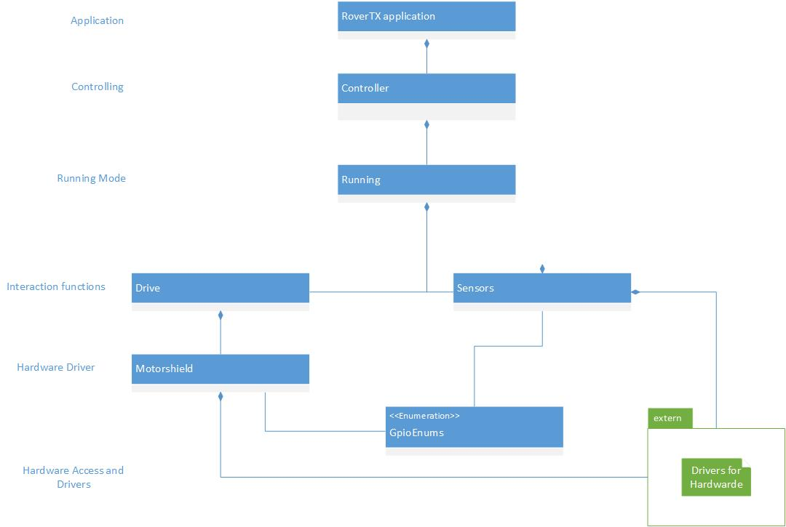

.. toctree::
   :glob:

RoverTX Software
#########################
For further description of the function and the functions of each class, please read the doxy on `Doxygen of source code <https://gitlab.idial.institute/panorama.gsoc.project/rover.doc/tree/master/doc/content/doxy/html>`_

*************************************************
Components
*************************************************
The used components of this software are shown in this picture:

	
This picture just shows the architecture of the software without any specific describtions and thus its no specific uml diagramm.
	
Controller
==============
As main class for the running application the controller class detects in a while loop which current mode is running and if a mode change is required or even if the application has to be stopped or terminated.
Via the pointer to the running object the controller class controls in which mode the application will run. 

Running
^^^^^^^^^^^^^^^^^^^^^^^^^^
The running class contains the functions for the behaviour of the different driving modes.
As main task the running class implements the intraction between the sensors and the drive class.
Therefore, the running class has a pointer for a sensors object and a drive object to access to their specific functionalities.
This class has also function for checking escape conditions and if driving is not allowed anymore.

Drive
==============
For the implementation of behaviours for different driving modes the drive class implements these functions.
These different driving modes require different driving functions.
Also these required fucntions are implemented in this class.
Therefore, the access to the motorshield is necessary.
Via the pointer to the motorshield object, the drive class can use the motor shield functions for the motor controlling.
To detect the escape condition, the drive class also implements check functions.

Motor shield
^^^^^^^^^^^^^^^^^^^^^^^^^^
As real hardware driver the motor shield class contains initialisation, deinitialisation and controlling functions.
Via the required GPIO pins and the pointer to the pwm driver object, the motorshield implements the required functions to use the motors.
The pwm driver is required, because the motor shield needs two signals for the pwm generation.
The first signal is the direction signal and the second signal is the pwm signal which delivers the speed for the motors.
If the motor shield and pwm driver are initialized the motor can start rotating.
Depending on the driving direction the motor has to rotate, the onspeed and offspeed for the pwm driver values should be different.
Otherwise the motors will not rotate.
The forward rotation values start from 15-255 and the backward rotation values from 240-0.

Sensors
==============
For accessing the used sensors or also GPIOs as input signals the sensors class delivers the interface.
Inside the sensors class interface are initialisation and read functions for the sensors and GPIOs.
At the moment this class just implements the read function for the HCSR04 ultrasonic sensor module but in short time the main read function will be able to detect via sensor type which sensor read function should be used.

Extern
==============
The extern components are used for getting acces to avaible hardware components like the pwm driver and the hcsr04 sensors.
The extern components are also used to get access to the GPIO controlling.